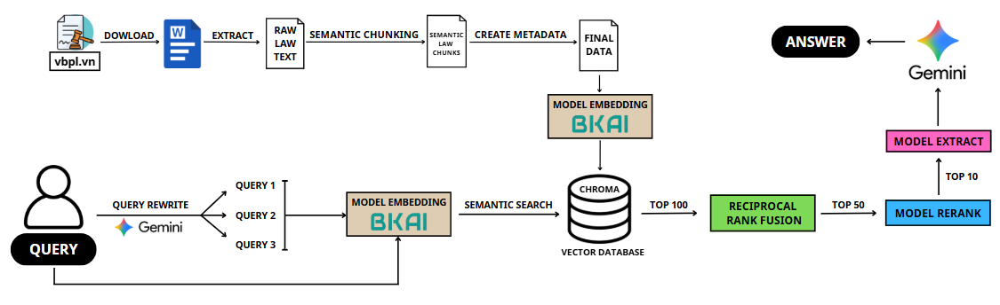

# **⚖️ Vietnamese Legal Retrieval System: Advanced Agentic RAG**
## **📝 Introduction**
This project focuses on researching and developing an automated question-answering system specifically for Vietnamese legal documents. By applying advanced Augmented Access (RAG) techniques combined with fine-tuning specialized language models, the system solves the problem of accurately retrieving information in documents with complex structures and specialized terminology.

**Executing member**
- Huỳnh Phát Đạt - ISE-UIT
- Bùi Quốc Bảo - ISE-UIT
- Lê Minh Khôi - ISE-UIT

## **📖 Data**
- [ViNLI_Zalo](https://huggingface.co/datasets/anti-ai/ViNLI-Zalo-supervised) dataset: Provides a structure including query, positive, and hard_neg. This is the primary data source for refining the Rerank model (sorting results) and the Extract/MRC model (extracting short answers).
- [thangvip/legal-documents-splitted](https://huggingface.co/datasets/thangvip/legal-documents-splitted) dataset: A collection of pre-processed and chunked legal documents (laws, decrees, circulars). This source is used to refine the Embedding model, enhancing the ability to represent legal semantics.
- [The National Database of Legal Documents (vbpl.vn)](https://vbpl.vn/pages/portal.aspx): Official documents are collected and standardized to build a Knowledge Base. This is the original data platform that directly serves the system's retrieval process.

## **🛠️ Arichitecture System**

The system development process is divided into five main phases
### 1. System Architecture Overview
- The system architecture is designed using a multi-tiered processing workflow to optimize retrieval and ensure accurate legal information responses.
- The system operates based on two main flows: a data preparation flow for building the knowledge base and a user query processing flow.
- The process is a flexible combination of large language models (LLM), embedding models, ranking models, and extraction models, all refined to ensure the output closely matches current legal texts.

### 2. Data Preparation and Knowledge Base Construction Phase
- Collecting legal texts from official sources (such as vbpl.vn), then converting them to .docx format to extract raw content.
- Semantic Chunking is applied based on rules rather than fixed-length segments to ensure content continuity.
- Each text segment is assigned supplementary metadata for later data filtering purposes.
- Data is encoded into vectors using the Embedding Model (BKAI) and stored in a vector database (Chroma) ready for querying.

### 3. Query Processing and Extension Process
- Upon receiving a query from the user, the system does not immediately search but optimizes the query using the Gemini model.
- Query Rewrite is used to create equivalent query versions, expanding the semantic search space.
- Extended queries are encoded using the same Embedding Model (BKAI) to ensure consistency between the query and the data warehouse.
- Perform semantic search to gather a list of the 100 most potentially relevant documents from the vector database.

### 4. Information Retrieval, Ranking, and Extraction Mechanism
- Apply the Reciprocal Rank Fusion (RRF) algorithm to filter from the initial 100 documents down to the 50 most relevant documents.
- Use a refined Model Rerank to further evaluate semantic correlations, further narrowing down to the 10 highest-quality documents.
- Use an Extract Model based on the BERT architecture to scan these documents and extract the most essential information segments.
- This extraction process completely removes irrelevant and redundant components, optimizing the input context for the final generation step.

### 5. Synthesizing and Generating Answers
- The refined extracted content, along with the user's original question, is fed into the large Gemini language model.
- The Gemini model synthesizes and interprets the disparate pieces of information into a complete, natural, and legally accurate answer.
- This multi-layered process helps the system provide well-founded answers while optimizing operating costs by minimizing unnecessary contextual tokens.

## **📊 Experiment**
### 1. Embedding Model
- Model Selection: Using bkai-foundation-models/vietnamese-bi-encoder (developed by BKAI - Hanoi University of Science and Technology).
- Architectural Advantages: Refined from PhoBERT v2, optimized for understanding the specific grammar and semantics of Vietnamese.
- Training on large datasets: MS MARCO, SQuAD v2 (Vietnamese localization), and especially ViNLI_Zalo.
- Performance: Achieved impressive experimental results on rule datasets with Accuracy@1: 73.28% and Accuracy@10: 93.59%.

### 2. Rerank Model Refinement
- Objective: Improve accuracy by clearly distinguishing between text that matches and does not match the query.
- Data Preparation: Using the anti-ai/ViNLI-Zalo-supervised dataset, convert it into pairs (query, document) with binary labels: label 1 (Positive) and label 0 (Hard Negative).
- Setup: Architecture: Cross-Encoder based on the gte-multilingual-reranker-base model.
- Mechanism: Uses the [CLS] token to converge information on sentence pair interactions, optimized using the Binary Cross-Entropy Loss function.
- Results: Outstanding performance with Accuracy and F1-Score of ~99.91%, Recall reaching 100%.
- It surpasses powerful pre-trained models like bge-reranker-v2-m3 (92.95%) and jina-reranker-v2-base (87.49%).

### 3. Extract Model Refinement
- Objective: To determine the start and end positions of answers in legal texts.
- Data Preparation: From the ViNLI_Zalo dataset, the team used Gemini to generate questions and corresponding answers from legal text contexts.
- The result is a standard MRC dataset with 3 components: Context - Question - Answer.
- Problem Setup: Extractive Question Answering based on a bert-base-multilingual-cased model.
- Results: 73.09% Exact Match (EM) (perfect match rate with sample answers), F1-Score: 82.39% (good ability to find overlapping information areas).

### 4. Overall System Evaluation
- Objective: To evaluate the impact of each module (Query Rewrite, Reranker, Extract) on response quality and system performance through testing various configurations.
- Evaluation Metrics:
    - ROUGE-L: Textual similarity
    - Semantic: Legal semantic cosine similarity.
    - Token Input: Measures system operating costs.

**🏁 Result**

| Method                                  | ROUGE-L | Semantic | Average Input Token on 10 Queries |
|-----------------------------------------|:-------:|:--------:|:----------------------------------:|
| Baseline                                | 0.4332  | 0.6807   | 158111 |
| Baseline + Rewrite                      | **0.4499** | 0.6632   | 78347  |
| Baseline + Rewrite + Rerank             | 0.4416  | **0.7232** | 19362  |
| Baseline + Rewrite + Rerank + Extract   | 0.3914  | 0.6748   | 919    |

- Effectiveness of Rerank model: The Baseline + Rewrite + Rerank configuration achieved the highest Semantic score (0.7232). This demonstrates that the Rerank model has been fine-tuned to effectively filter noise, prioritizing semantics over purely lexical matching, resulting in answers that are more relevant to legal practice.
- Rewrite's Role: This module helped ROUGE-L achieve the highest score (0.4499) thanks to its ability to clarify user intent. When combined with Rerank, the system prioritizes understanding meaning over just matching words.
- Cost Optimization (Input Tokens):
    - Reranker: Reduced the number of tokens input from 158,111 to **19,362** (saving approximately **75%**) while still improving response quality.
    - Extract: Reduced the number of tokens to a minimum (**919** tokens). However, the Semantic score decreased slightly (to 0.6748) due to the loss of some important context.

## 🚀 Conclusion & Future works
### 1. Conclusion
The team successfully developed a legal chatbot system based on an advanced RAG architecture, flexibly combining Rerank and Extract models. The results achieved include:
- Optimized performance and accuracy: Integrating the Rerank module refines retrieved text, ensuring only the most valuable legal grounds are included in the model generation, thereby improving the accuracy of responses.
- Resource and cost savings: Using a specialized Extract model minimizes the amount of data sent to the LLM (Gemini). This optimizes operational costs (API calls) and reduces system latency.
- High practicality: Effectively leveraging official data sources combined with Semantic Chunking techniques helps maintain the semantic integrity of complex legal provisions in practice.

### 2. Future works
- Optimized Vector Database: Research applying Matryoshka Representation Learning (MRL) techniques to flexibly adjust vector embedding size. This speeds up data retrieval across extremely large datasets while maintaining system performance.
- Expanded Knowledge Base: Integrating additional supporting document types such as case law, administrative decisions, and legal implementation guidelines. This expansion allows the chatbot to provide more comprehensive and in-depth legal advice.
- Enhanced User Experience and Reliability: Developing a feature to suggest relevant questions and directly display evidence (excerpts of specific clauses) on the interface. This improvement increases the transparency and reliability of the legal information provided.
- Utilizing Large-Scale Language Models: The focus on optimizing and utilizing modern large-scale language models such as Llama, Qwen, Mistral, etc., instead of the current Gemini, will further optimize system costs.
