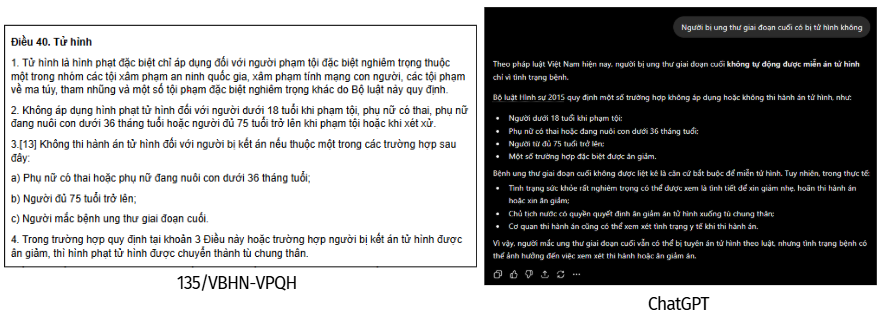
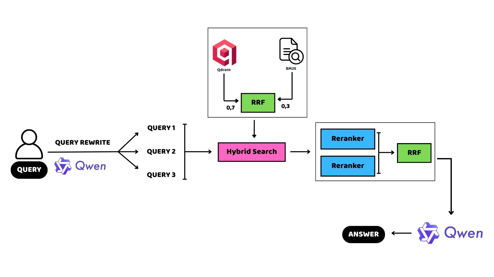

# **⚖️ Vietnamese Legal Retrieval System: Advanced Agentic RAG**
## **📝 Introduction**
This project presents a Vietnamese Legal Question Answering System based on a Retrieval-Augmented Generation (RAG) architecture to address the hallucinations, misinformation, or outdated knowledge of Vietnamese law presented by popular GenAIs such as ChatGPT, Gemini, etc. The system combines Query Rewrite, Hybrid Retrieval, Reciprocal Rank Fusion (RRF), and fine-tuned Embedding & Reranking models to retrieve relevant legal documents and generate accurate, evidence-based answers. The knowledge base is built from official Vietnamese legal documents, providing reliable support for legal information retrieval and question answering.

This is an example of ChatGPT providing misleading information about Vietnamese law:

**Executing member**
- Huỳnh Phát Đạt - ISE-UIT
- Bùi Quốc Bảo - ISE-UIT
- Lê Minh Khôi - ISE-UIT

## **Video demo**
Link : https://youtu.be/sArTNMoD1Dk.

## **📖 Data**

- **Knowledge Base:** A collection of **72 official Vietnamese legal documents** (Laws, Codes, and Decrees) collected from **"Thư Viện Pháp Luật"**, processed using hierarchical chunking and indexed for Hybrid Retrieval.

- **Fine-tuning Datasets:** The Embedding and Reranking models are fine-tuned using multiple Vietnamese legal resources and datasets, including [The National Database of Legal Documents (vbpl.vn)](https://vbpl.vn/pages/portal.aspx), [anti-ai/ViNLI-Zalo-supervised](https://huggingface.co/datasets/anti-ai/ViNLI-Zalo-supervised), [phamson02/large-vi-legal-queries](https://huggingface.co/datasets/phamson02/large-vi-legal-queries), [thangvip/legal-documents-splitted](https://huggingface.co/datasets/thangvip/legal-documents-splitted), and VLQA.

- **Evaluation Datasets:** Two ground-truth datasets are constructed for evaluation: a legal question-answering dataset with over **600** manually annotated samples used for the system's knowledge base, and a multiple-choice dataset containing **3,025** legal questions collected from various sources on the internet.

## **🛠️ Arichitecture System**

The proposed system consists of five main stages:

### 1. Knowledge Base Construction
- Collect and preprocess official Vietnamese legal documents.
- Apply hierarchical chunking to preserve the legal document structure.
- Build a Hybrid Retrieval index using Dense vectors (Qdrant) and BM25.

### 2. Query Processing
- Rewrite the user's query using **Qwen2.5-3B-Instruct** to generate semantically equivalent queries to broaden the search scope within the vector database.
- Encode all rewritten queries using the fine-tuned Embedding model.

### 3. Hybrid Retrieval
- Retrieve candidate documents using both Dense Search and BM25.
- Merge retrieval results with **Reciprocal Rank Fusion (RRF)** to improve recall.

### 4. Reranking
- Re-rank retrieved documents using fine-tuned Cross-Encoder Reranker models.
- Fuse reranking scores with RRF and select the top relevant legal passages.

### 5. Answer Generation
- Generate the final response using **Qwen2.5-3B-Instruct** based on the retrieved legal evidence.
- Produce concise, accurate, and legally grounded answers.

## **📊 Experiments**

Our system is evaluated at both the model and system levels to measure the effectiveness of each component in the RAG pipeline.

### 1. Embedding Model
- Fine-tuned on [intfloat/multilingual-e5-base](https://huggingface.co/intfloat/multilingual-e5-base) model (Bi-Encoder) and Vietnamese legal datasets to improve semantic representation of legal queries and documents.
- Evaluated using retrieval metrics such as **NDCG@10**, **Recall@10**, and **MRR**.

### 2. Reranking Model
- Fine-tuned on [Alibaba-NLP/gte-multilingual-reranker-base](https://huggingface.co/Alibaba-NLP/gte-multilingual-reranker-base) model (Cross-Encoder) are used to re-rank retrieved candidates based on semantic relevance.
- The model is evaluated using classification metrics, including **Accuracy**, **Precision**, **Recall**, and **F1-score**.

### 3. End-to-End RAG System
- The complete RAG pipeline is evaluated on three tasks:
  - **Legal document retrieval**
  - **Legal multiple-choice reasoning**
  - **Legal answer generation**
- The evaluation uses two manually constructed ground-truth datasets consisting of legal QA pairs and multiple-choice questions.

## **🏁 Results**

The experimental results demonstrate that the proposed RAG architecture achieves strong performance across all evaluation tasks.

| **Task** | **Metric** | **Score** |
|:----------------------------|:------------------:|:---------:|
| Retrieval | NDCG@10 | **0.7904** |
| Retrieval | Recall@10 | **0.8725** |
| Multiple-choice Reasoning | F1-score | **≈ 0.58** |
| Answer Generation | Cosine Similarity | **≈ 0.73** |
| Answer Generation | BERTScore F1 | **≈ 0.73** |

### Highlights
- Fine-tuning significantly improves the retrieval performance of the Embedding and Reranking models for Vietnamese legal documents.
- Hybrid Retrieval combined with Rewrite and Rerank module provides high retrieval accuracy while maintaining good coverage.
- The proposed RAG system effectively retrieves relevant legal evidence and generates accurate, legally grounded responses with strong semantic similarity to reference answers.

## **🚀 Conclusion & Future works**

### **Conclusion**

This project presents a Vietnamese Legal Question Answering System based on an advanced RAG architecture. By combining Query Rewrite, Hybrid Retrieval, Reciprocal Rank Fusion (RRF), and fine-tuned Embedding and Reranking models, the system effectively retrieves relevant legal documents and generates accurate, evidence-based responses.

Experimental results demonstrate that the proposed approach achieves strong performance in legal document retrieval, multiple-choice reasoning, and answer generation, showing its potential for real-world legal information retrieval applications.

### **Future Works**

- Expand the knowledge base with additional legal resources such as case law, administrative decisions, and legal guidance documents.
- Improve retrieval efficiency by exploring advanced vector indexing and retrieval optimization techniques.
- Fine-tune larger open-source LLMs to further improve answer quality while maintaining low deployment costs.
- Enhance the user experience by providing legal evidence, source citations, and interactive explanations for generated answers.
